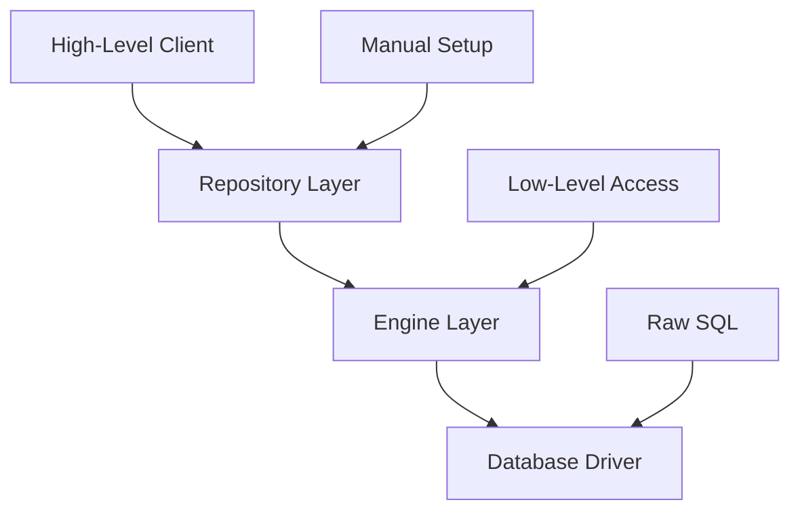

# Client and Engine Usage - Simplification Guide

This guide shows you how to use Goofer ORM's client and engine components effectively, providing both high-level convenience and low-level control when needed.

## Overview of Architecture

Goofer ORM provides multiple layers of abstraction:



## High-Level Client Usage (Recommended)

The client provides the simplest way to get started with Goofer ORM.

### Basic Client Setup

```go
package main

import (
    "log"
    
    "github.com/gooferOrm/goofer/client"
)

func main() {
    // Initialize client with minimal configuration
    gooferClient, err := client.New(client.Config{
        DatabaseURL: "sqlite://./app.db",
        Dialect:     "sqlite",
        AutoMigrate: true, // Automatically create/update tables
        LogQueries:  true, // Log SQL queries in development
    })
    if err != nil {
        log.Fatal("Failed to initialize Goofer client:", err)
    }
    defer gooferClient.Close()
    
    // Register your models (automatic table creation)
    gooferClient.RegisterModels(
        &User{},
        &Post{},
        &Category{},
    )
    
    // Get repositories
    userRepo := gooferClient.Repository[User]()
    postRepo := gooferClient.Repository[Post]()
    
    // Use repositories normally
    user := &User{Name: "John", Email: "john@example.com"}
    if err := userRepo.Save(user); err != nil {
        log.Fatal("Failed to save user:", err)
    }
    
    log.Printf("Created user with ID: %d", user.ID)
}
```

### Environment-Based Configuration

```go
// config.go
type AppConfig struct {
    Environment string
    Database    DatabaseConfig
}

type DatabaseConfig struct {
    URL         string
    Dialect     string
    AutoMigrate bool
    LogQueries  bool
}

func LoadConfig() (*AppConfig, error) {
    env := os.Getenv("ENVIRONMENT")
    if env == "" {
        env = "development"
    }
    
    config := &AppConfig{Environment: env}
    
    switch env {
    case "development":
        config.Database = DatabaseConfig{
            URL:         "sqlite://./dev.db",
            Dialect:     "sqlite",
            AutoMigrate: true,
            LogQueries:  true,
        }
    case "test":
        config.Database = DatabaseConfig{
            URL:         "sqlite://:memory:",
            Dialect:     "sqlite", 
            AutoMigrate: true,
            LogQueries:  false,
        }
    case "production":
        config.Database = DatabaseConfig{
            URL:         os.Getenv("DATABASE_URL"),
            Dialect:     os.Getenv("DB_DIALECT"),
            AutoMigrate: false, // Use migrations in production
            LogQueries:  false,
        }
    }
    
    return config, nil
}

// main.go
func main() {
    config, err := LoadConfig()
    if err != nil {
        log.Fatal("Failed to load config:", err)
    }
    
    gooferClient, err := client.New(client.Config(config.Database))
    if err != nil {
        log.Fatal("Failed to initialize client:", err)
    }
    defer gooferClient.Close()
    
    // Register models
    gooferClient.RegisterModels(&User{}, &Post{})
    
    // Your application logic...
}
```

### Client with Dependency Injection

```go
// services.go
type Services struct {
    UserService *UserService
    PostService *PostService
    AuthService *AuthService
}

func NewServices(gooferClient *client.Client) *Services {
    userRepo := gooferClient.Repository[User]()
    postRepo := gooferClient.Repository[Post]()
    
    return &Services{
        UserService: NewUserService(userRepo),
        PostService: NewPostService(postRepo, userRepo),
        AuthService: NewAuthService(userRepo),
    }
}

// main.go  
func main() {
    gooferClient, err := initializeClient()
    if err != nil {
        log.Fatal(err)
    }
    defer gooferClient.Close()
    
    services := NewServices(gooferClient)
    
    // Setup HTTP server with services
    setupHTTPServer(services)
}
```

## Engine-Level Usage (Advanced Control)

When you need more control over the database connection and configuration.

### Engine Setup

```go
package main

import (
    "database/sql"
    "time"
    
    _ "github.com/mattn/go-sqlite3"
    
    "github.com/gooferOrm/goofer/engine"
    "github.com/gooferOrm/goofer/dialect"
    "github.com/gooferOrm/goofer/repository"
    "github.com/gooferOrm/goofer/schema"
)

func main() {
    // Create engine with custom configuration
    eng, err := engine.New(engine.Config{
        Driver:          "sqlite3",
        DataSource:      "./app.db",
        MaxOpenConns:    25,
        MaxIdleConns:    5,
        ConnMaxLifetime: time.Hour,
        ConnMaxIdleTime: 30 * time.Minute,
    })
    if err != nil {
        log.Fatal("Failed to create engine:", err)
    }
    defer eng.Close()
    
    // Create dialect
    sqliteDialect := dialect.NewSQLiteDialect()
    
    // Manual entity registration
    if err := schema.Registry.RegisterEntity(User{}); err != nil {
        log.Fatal("Failed to register User entity:", err)
    }
    
    // Create tables manually
    userMeta, _ := schema.Registry.GetEntityMetadata(schema.GetEntityType(User{}))
    createSQL := sqliteDialect.CreateTableSQL(userMeta)
    if _, err := eng.DB().Exec(createSQL); err != nil {
        log.Fatal("Failed to create table:", err)
    }
    
    // Create repository with engine
    userRepo := repository.NewRepository[User](eng.DB(), sqliteDialect)
    
    // Use repository
    user := &User{Name: "Jane", Email: "jane@example.com"}
    if err := userRepo.Save(user); err != nil {
        log.Fatal("Failed to save user:", err)
    }
}
```

### Connection Pool Configuration

```go
func setupDatabase() (*engine.Engine, error) {
    config := engine.Config{
        Driver:     "postgres",
        DataSource: "host=localhost user=myuser dbname=mydb sslmode=disable",
        
        // Connection pool settings
        MaxOpenConns:    50,              // Maximum open connections
        MaxIdleConns:    10,              // Maximum idle connections
        ConnMaxLifetime: 1 * time.Hour,   // Maximum connection lifetime
        ConnMaxIdleTime: 10 * time.Minute, // Maximum idle time
        
        // Health check settings
        PingInterval: 30 * time.Second,   // Health check interval
        PingTimeout:  5 * time.Second,    // Health check timeout
    }
    
    eng, err := engine.New(config)
    if err != nil {
        return nil, err
    }
    
    // Test connection
    if err := eng.Ping(); err != nil {
        return nil, fmt.Errorf("database ping failed: %w", err)
    }
    
    return eng, nil
}
```

### Multiple Database Connections

```go
type DatabaseManager struct {
    primary   *engine.Engine
    readonly  *engine.Engine
    analytics *engine.Engine
}

func NewDatabaseManager() (*DatabaseManager, error) {
    // Primary database for writes
    primary, err := engine.New(engine.Config{
        Driver:       "postgres",
        DataSource:   os.Getenv("PRIMARY_DB_URL"),
        MaxOpenConns: 25,
        MaxIdleConns: 5,
    })
    if err != nil {
        return nil, err
    }
    
    // Read-only replica
    readonly, err := engine.New(engine.Config{
        Driver:       "postgres", 
        DataSource:   os.Getenv("READONLY_DB_URL"),
        MaxOpenConns: 15,
        MaxIdleConns: 3,
    })
    if err != nil {
        return nil, err
    }
    
    // Analytics database (separate)
    analytics, err := engine.New(engine.Config{
        Driver:       "postgres",
        DataSource:   os.Getenv("ANALYTICS_DB_URL"),
        MaxOpenConns: 10,
        MaxIdleConns: 2,
    })
    if err != nil {
        return nil, err
    }
    
    return &DatabaseManager{
        primary:   primary,
        readonly:  readonly,
        analytics: analytics,
    }, nil
}

func (dm *DatabaseManager) UserRepository() *repository.Repository[User] {
    return repository.NewRepository[User](dm.primary.DB(), dialect.NewPostgresDialect())
}

func (dm *DatabaseManager) ReadOnlyUserRepository() *repository.Repository[User] {
    return repository.NewRepository[User](dm.readonly.DB(), dialect.NewPostgresDialect())
}
```

## Simplified Usage Patterns

### Application Factory Pattern

```go
// app.go
type App struct {
    client   *client.Client
    services *Services
    config   *Config
}

func NewApp(configPath string) (*App, error) {
    // Load configuration
    config, err := LoadConfig(configPath)
    if err != nil {
        return nil, err
    }
    
    // Initialize client
    gooferClient, err := client.New(config.Database)
    if err != nil {
        return nil, err
    }
    
    // Register all models
    gooferClient.RegisterModels(getAllModels()...)
    
    // Initialize services
    services := NewServices(gooferClient)
    
    return &App{
        client:   gooferClient,
        services: services,
        config:   config,
    }, nil
}

func (a *App) Start() error {
    // Start HTTP server
    return a.startHTTPServer()
}

func (a *App) Close() error {
    return a.client.Close()
}

// main.go
func main() {
    app, err := NewApp("config.yaml")
    if err != nil {
        log.Fatal("Failed to create app:", err)
    }
    defer app.Close()
    
    if err := app.Start(); err != nil {
        log.Fatal("Failed to start app:", err)
    }
}
```

### Service Layer Pattern

```go
// user_service.go
type UserService struct {
    repo *repository.Repository[User]
}

func NewUserService(repo *repository.Repository[User]) *UserService {
    return &UserService{repo: repo}
}

func (s *UserService) CreateUser(req CreateUserRequest) (*User, error) {
    user := &User{
        Username:  req.Username,
        Email:     req.Email,
        Password:  req.Password, // Will be hashed by hook
        FirstName: req.FirstName,
        LastName:  req.LastName,
    }
    
    if err := s.repo.Save(user); err != nil {
        return nil, fmt.Errorf("failed to create user: %w", err)
    }
    
    return user, nil
}

func (s *UserService) GetUserByEmail(email string) (*User, error) {
    user, err := s.repo.Find().Where("email = ?", email).First()
    if err != nil {
        return nil, fmt.Errorf("user not found: %w", err)
    }
    
    return user, nil
}

func (s *UserService) UpdateUser(id uint, req UpdateUserRequest) (*User, error) {
    user, err := s.repo.FindByID(id)
    if err != nil {
        return nil, fmt.Errorf("user not found: %w", err)
    }
    
    // Update fields
    if req.FirstName != nil {
        user.FirstName = *req.FirstName
    }
    if req.LastName != nil {
        user.LastName = *req.LastName
    }
    if req.Bio != nil {
        user.Bio = *req.Bio
    }
    
    if err := s.repo.Save(user); err != nil {
        return nil, fmt.Errorf("failed to update user: %w", err)
    }
    
    return user, nil
}

func (s *UserService) DeleteUser(id uint) error {
    return s.repo.DeleteByID(id)
}
```

### Repository Wrapper Pattern

```go
// enhanced_repository.go
type EnhancedUserRepository struct {
    *repository.Repository[User]
    cache map[uint]*User
    mutex sync.RWMutex
}

func NewEnhancedUserRepository(repo *repository.Repository[User]) *EnhancedUserRepository {
    return &EnhancedUserRepository{
        Repository: repo,
        cache:      make(map[uint]*User),
    }
}

func (r *EnhancedUserRepository) FindByIDCached(id uint) (*User, error) {
    // Check cache first
    r.mutex.RLock()
    if user, exists := r.cache[id]; exists {
        r.mutex.RUnlock()
        return user, nil
    }
    r.mutex.RUnlock()
    
    // Load from database
    user, err := r.Repository.FindByID(id)
    if err != nil {
        return nil, err
    }
    
    // Cache result
    r.mutex.Lock()
    r.cache[id] = user
    r.mutex.Unlock()
    
    return user, nil
}

func (r *EnhancedUserRepository) SaveWithCache(user *User) error {
    if err := r.Repository.Save(user); err != nil {
        return err
    }
    
    // Update cache
    r.mutex.Lock()
    r.cache[user.ID] = user
    r.mutex.Unlock()
    
    return nil
}

func (r *EnhancedUserRepository) InvalidateCache(id uint) {
    r.mutex.Lock()
    delete(r.cache, id)
    r.mutex.Unlock()
}
```

## Testing Patterns

### Test Client Setup

```go
// test_helpers.go
func SetupTestClient(t *testing.T) *client.Client {
    gooferClient, err := client.New(client.Config{
        DatabaseURL: "sqlite://:memory:",
        Dialect:     "sqlite",
        AutoMigrate: true,
        LogQueries:  false,
    })
    require.NoError(t, err)
    
    // Register test models
    gooferClient.RegisterModels(&User{}, &Post{})
    
    // Cleanup function
    t.Cleanup(func() {
        gooferClient.Close()
    })
    
    return gooferClient
}

func TestUserService(t *testing.T) {
    client := SetupTestClient(t)
    userRepo := client.Repository[User]()
    userService := NewUserService(userRepo)
    
    t.Run("CreateUser", func(t *testing.T) {
        req := CreateUserRequest{
            Username:  "testuser",
            Email:     "test@example.com",
            Password:  "password123",
            FirstName: "Test",
            LastName:  "User",
        }
        
        user, err := userService.CreateUser(req)
        require.NoError(t, err)
        assert.Equal(t, req.Username, user.Username)
        assert.NotZero(t, user.ID)
    })
}
```

### Mock Repository Pattern

```go
// mock_repository.go
type MockUserRepository struct {
    users   map[uint]*User
    nextID  uint
    mutex   sync.RWMutex
}

func NewMockUserRepository() *MockUserRepository {
    return &MockUserRepository{
        users:  make(map[uint]*User),
        nextID: 1,
    }
}

func (m *MockUserRepository) Save(user *User) error {
    m.mutex.Lock()
    defer m.mutex.Unlock()
    
    if user.ID == 0 {
        user.ID = m.nextID
        m.nextID++
    }
    
    m.users[user.ID] = user
    return nil
}

func (m *MockUserRepository) FindByID(id uint) (*User, error) {
    m.mutex.RLock()
    defer m.mutex.RUnlock()
    
    user, exists := m.users[id]
    if !exists {
        return nil, fmt.Errorf("user not found")
    }
    
    return user, nil
}

// Usage in tests
func TestUserServiceWithMock(t *testing.T) {
    mockRepo := NewMockUserRepository()
    userService := NewUserService(mockRepo)
    
    // Test without database
    user, err := userService.CreateUser(CreateUserRequest{
        Username: "testuser",
        Email:    "test@example.com",
    })
    
    require.NoError(t, err)
    assert.Equal(t, uint(1), user.ID)
}
```

## Production Patterns

### Health Checks

```go
func (a *App) HealthCheck() error {
    // Check database connectivity
    if err := a.client.Ping(); err != nil {
        return fmt.Errorf("database health check failed: %w", err)
    }
    
    // Check basic operations
    userRepo := a.client.Repository[User]()
    if _, err := userRepo.Find().Limit(1).Count(); err != nil {
        return fmt.Errorf("database query failed: %w", err)
    }
    
    return nil
}

// HTTP health endpoint
func (a *App) healthHandler(w http.ResponseWriter, r *http.Request) {
    if err := a.HealthCheck(); err != nil {
        w.WriteHeader(http.StatusServiceUnavailable)
        json.NewEncoder(w).Encode(map[string]string{
            "status": "unhealthy",
            "error":  err.Error(),
        })
        return
    }
    
    w.WriteHeader(http.StatusOK)
    json.NewEncoder(w).Encode(map[string]string{
        "status": "healthy",
    })
}
```

### Graceful Shutdown

```go
func (a *App) Start() error {
    server := &http.Server{
        Addr:    fmt.Sprintf(":%d", a.config.Port),
        Handler: a.setupRoutes(),
    }
    
    // Start server in goroutine
    go func() {
        if err := server.ListenAndServe(); err != nil && err != http.ErrServerClosed {
            log.Printf("Server error: %v", err)
        }
    }()
    
    // Wait for interrupt signal
    quit := make(chan os.Signal, 1)
    signal.Notify(quit, syscall.SIGINT, syscall.SIGTERM)
    <-quit
    
    log.Println("Shutting down server...")
    
    // Graceful shutdown with timeout
    ctx, cancel := context.WithTimeout(context.Background(), 30*time.Second)
    defer cancel()
    
    if err := server.Shutdown(ctx); err != nil {
        log.Printf("Server forced to shutdown: %v", err)
    }
    
    // Close database connections
    if err := a.client.Close(); err != nil {
        log.Printf("Error closing database: %v", err)
    }
    
    log.Println("Server exited")
    return nil
}
```

## Best Practices Summary

### When to Use Client vs Engine

**Use Client when:**
- Building new applications
- Want simplicity and convention over configuration
- Need automatic migrations in development
- Standard use cases are sufficient

**Use Engine when:**
- Need fine-grained control over database connections
- Working with existing database schemas
- Custom connection pooling requirements
- Multiple database connections
- Performance-critical applications

### Configuration Tips

1. **Use environment variables** for database URLs in production
2. **Enable AutoMigrate** only in development/test environments
3. **Set appropriate connection pool sizes** based on your workload
4. **Use read-only replicas** for read-heavy operations
5. **Implement health checks** for monitoring
6. **Set up graceful shutdown** for production deployments

### Performance Optimization

1. **Configure connection pools** appropriately
2. **Use caching** for frequently accessed data
3. **Implement proper indexes** on frequently queried columns
4. **Use eager loading** to avoid N+1 queries
5. **Monitor query performance** and optimize slow queries

This guide provides a complete overview of how to effectively use Goofer ORM's client and engine components in various scenarios, from simple applications to complex production systems.