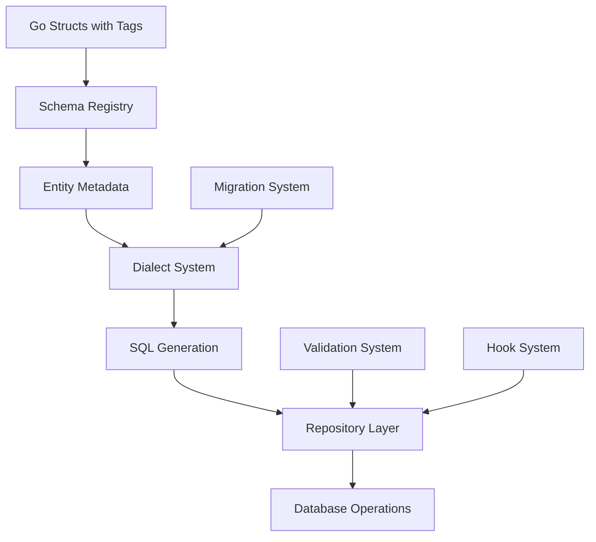

# Goofer ORM - Comprehensive Usage Guide

This guide provides a deep dive into the Goofer ORM, covering everything from basic concepts to advanced usage patterns. You'll learn how the ORM generates SQL from your Go structs, how to leverage the full power of the repository pattern, and how to build production-ready applications.

## Table of Contents

1. [Understanding Goofer ORM Architecture](#understanding-goofer-orm-architecture)
2. [From Structs to SQL: The Complete Flow](#from-structs-to-sql-the-complete-flow)
3. [Step-by-Step Setup Guide](#step-by-step-setup-guide)
4. [Entity Definition Mastery](#entity-definition-mastery)
5. [Repository Pattern Deep Dive](#repository-pattern-deep-dive)
6. [Query Builder Advanced Usage](#query-builder-advanced-usage)
7. [Relationship Management](#relationship-management)
8. [Transaction Management](#transaction-management)
9. [Lifecycle Hooks and Events](#lifecycle-hooks-and-events)
10. [Validation System](#validation-system)
11. [Migration System](#migration-system)
12. [Client and Engine Usage](#client-and-engine-usage)
13. [Performance Optimization](#performance-optimization)
14. [Production Best Practices](#production-best-practices)
15. [Troubleshooting Guide](#troubleshooting-guide)

## Understanding Goofer ORM Architecture

Goofer ORM is built around several core components that work together to provide a type-safe, intuitive database interface:

### Core Components



#### 1. Schema Registry
The heart of Goofer ORM that:
- Analyzes your struct definitions using reflection
- Extracts metadata from struct tags
- Maintains a registry of all registered entities
- Provides type information for SQL generation

#### 2. Dialect System
Database-agnostic abstraction that:
- Handles differences between database systems
- Generates appropriate SQL syntax for each database
- Manages data type mappings
- Handles identifier quoting and placeholders

#### 3. Repository Pattern
Type-safe database operations through:
- Generic repository interface
- Query builder for complex queries
- Transaction management
- Automatic validation and hooks

#### 4. Engine System
Low-level components that:
- Execute SQL queries
- Handle connection management
- Provide raw database access when needed
- Support custom query execution

## From Structs to SQL: The Complete Flow

Let's trace how Goofer ORM transforms your Go structs into database operations:

### Step 1: Struct Definition

```go
type User struct {
    ID        uint      `orm:"primaryKey;autoIncrement" validate:"required"`
    Name      string    `orm:"type:varchar(255);notnull" validate:"required,min=2"`
    Email     string    `orm:"unique;type:varchar(255);notnull" validate:"required,email"`
    Age       int       `orm:"type:int" validate:"gte=0,lte=130"`
    CreatedAt time.Time `orm:"type:timestamp;default:CURRENT_TIMESTAMP"`
    UpdatedAt time.Time `orm:"type:timestamp"`
    Posts     []Post    `orm:"relation:OneToMany;foreignKey:UserID"`
}

func (User) TableName() string {
    return "users"
}
```

### Step 2: Registration and Metadata Extraction

When you register an entity:

```go
schema.Registry.RegisterEntity(User{})
```

The ORM performs the following:

1. **Reflection Analysis**: Uses Go's reflection to examine the struct
2. **Tag Parsing**: Extracts ORM configuration from struct tags
3. **Metadata Creation**: Creates `EntityMetadata` with field information
4. **Validation Setup**: Configures validation rules
5. **Relationship Mapping**: Identifies and configures relationships

Generated metadata structure:
```go
EntityMetadata{
    Type:      reflect.TypeOf(User{}),
    TableName: "users",
    Fields: []FieldMetadata{
        {
            Name:         "ID",
            DBName:       "id",
            Type:         "uint",
            IsPrimaryKey: true,
            IsAutoIncr:   true,
            IsNullable:   false,
        },
        {
            Name:       "Name", 
            DBName:     "name",
            Type:       "varchar(255)",
            IsNullable: false,
        },
        // ... more fields
    },
}
```

### Step 3: SQL Generation

When creating tables, the dialect system generates appropriate SQL:

```sql
-- SQLite Output
CREATE TABLE IF NOT EXISTS "users" (
  "id" INTEGER PRIMARY KEY AUTOINCREMENT,
  "name" TEXT NOT NULL,
  "email" TEXT NOT NULL UNIQUE,
  "age" INTEGER,
  "created_at" TEXT DEFAULT CURRENT_TIMESTAMP,
  "updated_at" TEXT
);

-- MySQL Output  
CREATE TABLE IF NOT EXISTS `users` (
  `id` INTEGER PRIMARY KEY AUTO_INCREMENT,
  `name` varchar(255) NOT NULL,
  `email` varchar(255) NOT NULL UNIQUE,
  `age` INTEGER,
  `created_at` timestamp DEFAULT CURRENT_TIMESTAMP,
  `updated_at` timestamp
) ENGINE=InnoDB DEFAULT CHARSET=utf8mb4 COLLATE=utf8mb4_unicode_ci;

-- PostgreSQL Output
CREATE TABLE IF NOT EXISTS "users" (
  "id" SERIAL PRIMARY KEY,
  "name" varchar(255) NOT NULL,
  "email" varchar(255) NOT NULL UNIQUE,
  "age" INTEGER,
  "created_at" timestamp DEFAULT CURRENT_TIMESTAMP,
  "updated_at" timestamp
);
```

### Step 4: Repository Operations

The repository layer provides type-safe operations:

```go
userRepo := repository.NewRepository[User](db, dialect)

// Create (INSERT)
user := &User{Name: "John", Email: "john@example.com", Age: 30}
userRepo.Save(user) // Generates: INSERT INTO users (name, email, age, created_at) VALUES (?, ?, ?, ?)

// Read (SELECT)
foundUser, _ := userRepo.FindByID(1) // Generates: SELECT * FROM users WHERE id = ?

// Query Builder
users, _ := userRepo.Find().
    Where("age > ?", 18).
    OrderBy("name ASC").
    Limit(10).
    All()
// Generates: SELECT * FROM users WHERE age > ? ORDER BY name ASC LIMIT 10

// Update
foundUser.Name = "Jane"
userRepo.Save(foundUser) // Generates: UPDATE users SET name = ?, updated_at = ? WHERE id = ?

// Delete
userRepo.Delete(foundUser) // Generates: DELETE FROM users WHERE id = ?
```

## Step-by-Step Setup Guide

### 1. Installation

```bash
go get github.com/gooferOrm/goofer
```

### 2. Choose Your Database Driver

```bash
# SQLite
go get github.com/mattn/go-sqlite3

# MySQL  
go get github.com/go-sql-driver/mysql

# PostgreSQL
go get github.com/lib/pq
```

### 3. Initialize Database Connection

```go
package main

import (
    "database/sql"
    "log"
    
    _ "github.com/mattn/go-sqlite3" // or your chosen driver
    
    "github.com/gooferOrm/goofer/dialect"
    "github.com/gooferOrm/goofer/repository"
    "github.com/gooferOrm/goofer/schema"
)

func main() {
    // Open database connection
    db, err := sql.Open("sqlite3", "./app.db")
    if err != nil {
        log.Fatalf("Failed to open database: %v", err)
    }
    defer db.Close()
    
    // Create dialect
    sqliteDialect := dialect.NewSQLiteDialect()
    
    // Continue with entity registration...
}
```

### 4. Define and Register Entities

```go
// Define your entities
type User struct {
    ID        uint      `orm:"primaryKey;autoIncrement"`
    Name      string    `orm:"type:varchar(255);notnull"`
    Email     string    `orm:"unique;type:varchar(255);notnull"`
    CreatedAt time.Time `orm:"type:timestamp;default:CURRENT_TIMESTAMP"`
}

func (User) TableName() string { return "users" }

// Register entities
if err := schema.Registry.RegisterEntity(User{}); err != nil {
    log.Fatalf("Failed to register User entity: %v", err)
}
```

### 5. Create Tables

```go
// Get entity metadata
userMeta, ok := schema.Registry.GetEntityMetadata(schema.GetEntityType(User{}))
if !ok {
    log.Fatal("Failed to get User entity metadata")
}

// Generate and execute CREATE TABLE SQL
createSQL := sqliteDialect.CreateTableSQL(userMeta)
_, err = db.Exec(createSQL)
if err != nil {
    log.Fatalf("Failed to create table: %v", err)
}
```

### 6. Create Repository and Start Using

```go
// Create repository
userRepo := repository.NewRepository[User](db, sqliteDialect)

// Now you can perform database operations
user := &User{
    Name:  "John Doe",
    Email: "john@example.com",
}

if err := userRepo.Save(user); err != nil {
    log.Fatalf("Failed to save user: %v", err)
}

log.Printf("Created user with ID: %d", user.ID)
```

## Entity Definition Mastery

### Understanding ORM Tags

Goofer ORM uses struct tags to configure database mappings. The tag format is:

```
`orm:"option1;option2;option3"`
```

#### Primary Key Configuration

```go
type User struct {
    // Auto-incrementing primary key
    ID uint `orm:"primaryKey;autoIncrement"`
    
    // Composite primary key
    UserID uint `orm:"primaryKey"`
    PostID uint `orm:"primaryKey"`
    
    // UUID primary key  
    ID uuid.UUID `orm:"primaryKey;type:varchar(36)"`
}
```

#### Column Types and Constraints

```go
type Product struct {
    ID          uint           `orm:"primaryKey;autoIncrement"`
    Name        string         `orm:"type:varchar(255);notnull"`
    Description string         `orm:"type:text"`
    Price       decimal.Decimal `orm:"type:decimal(10,2);notnull"`
    SKU         string         `orm:"type:varchar(50);unique;notnull"`
    CategoryID  uint           `orm:"index;notnull"`
    IsActive    bool           `orm:"type:boolean;default:true"`
    CreatedAt   time.Time      `orm:"type:timestamp;default:CURRENT_TIMESTAMP"`
    UpdatedAt   *time.Time     `orm:"type:timestamp"` // Nullable
}
```

#### Available Tag Options

| Tag | Description | Example |
|-----|-------------|---------|
| `primaryKey` | Marks field as primary key | `orm:"primaryKey"` |
| `autoIncrement` | Enables auto-increment | `orm:"autoIncrement"` |
| `type:TYPE` | Specifies database column type | `orm:"type:varchar(255)"` |
| `notnull` | Makes column NOT NULL | `orm:"notnull"` |
| `unique` | Adds unique constraint | `orm:"unique"` |
| `index` | Creates index on column | `orm:"index"` |
| `default:VALUE` | Sets default value | `orm:"default:CURRENT_TIMESTAMP"` |
| `relation:TYPE` | Defines relationship | `orm:"relation:OneToMany"` |
| `foreignKey:FIELD` | Specifies foreign key | `orm:"foreignKey:UserID"` |
| `joinTable:TABLE` | Join table for many-to-many | `orm:"joinTable:user_roles"` |
| `referenceKey:FIELD` | Reference key for many-to-many | `orm:"referenceKey:RoleID"` |

### Advanced Entity Patterns

#### Embedded Structs

```go
type Timestamps struct {
    CreatedAt time.Time  `orm:"type:timestamp;default:CURRENT_TIMESTAMP"`
    UpdatedAt *time.Time `orm:"type:timestamp"`
}

type User struct {
    ID    uint   `orm:"primaryKey;autoIncrement"`
    Name  string `orm:"type:varchar(255);notnull"`
    Email string `orm:"unique;type:varchar(255);notnull"`
    
    Timestamps // Embedded struct
}
```

#### Soft Delete Pattern

```go
type SoftDeleteModel struct {
    DeletedAt *time.Time `orm:"type:timestamp;index"`
}

type User struct {
    ID    uint   `orm:"primaryKey;autoIncrement"`
    Name  string `orm:"type:varchar(255);notnull"`
    Email string `orm:"unique;type:varchar(255);notnull"`
    
    SoftDeleteModel // Adds soft delete capability
}

// Implement soft delete interface
func (u *User) IsDeleted() bool {
    return u.DeletedAt != nil
}

func (u *User) MarkAsDeleted() {
    now := time.Now()
    u.DeletedAt = &now
}
```

## Repository Pattern Deep Dive

The Repository pattern in Goofer ORM provides a clean, type-safe interface for database operations.

### Creating Repositories

```go
// Basic repository creation
userRepo := repository.NewRepository[User](db, dialect)

// Repository with custom configuration
config := repository.Config{
    EnableValidation: true,
    EnableHooks:     true,
    CacheMetadata:   true,
}
userRepo := repository.NewRepositoryWithConfig[User](db, dialect, config)
```

### CRUD Operations

#### Create (Insert)

```go
// Single entity
user := &User{Name: "John", Email: "john@example.com"}
err := userRepo.Save(user)
// user.ID is now populated

// Batch insert
users := []*User{
    {Name: "Alice", Email: "alice@example.com"},
    {Name: "Bob", Email: "bob@example.com"},
}
err := userRepo.SaveAll(users)
```

#### Read (Select)

```go
// Find by primary key
user, err := userRepo.FindByID(1)

// Find first matching record
user, err := userRepo.Find().Where("email = ?", "john@example.com").First()

// Find all matching records
users, err := userRepo.Find().Where("age > ?", 18).All()

// Count records
count, err := userRepo.Find().Where("age > ?", 18).Count()

// Check existence
exists, err := userRepo.Find().Where("email = ?", "john@example.com").Exists()
```

#### Update

```go
// Update existing entity
user.Name = "John Updated"
err := userRepo.Save(user) // Uses UPDATE if ID exists

// Batch update
err := userRepo.Update().
    Set("name", "Updated Name").
    Where("age > ?", 18).
    Execute()
```

#### Delete

```go
// Delete by entity
err := userRepo.Delete(user)

// Delete by ID
err := userRepo.DeleteByID(1)

// Batch delete
err := userRepo.DeleteWhere("age < ?", 18)
```

### Advanced Query Building

#### Complex WHERE Conditions

```go
// Multiple conditions with AND
users, err := userRepo.Find().
    Where("age > ?", 18).
    Where("name LIKE ?", "%John%").
    Where("email IS NOT NULL").
    All()

// OR conditions
users, err := userRepo.Find().
    Where("age > ? OR name LIKE ?", 25, "%Admin%").
    All()

// IN conditions
users, err := userRepo.Find().
    WhereIn("id", []interface{}{1, 2, 3, 4, 5}).
    All()

// BETWEEN conditions
users, err := userRepo.Find().
    WhereBetween("age", 18, 65).
    All()

// NULL checks
users, err := userRepo.Find().
    WhereNotNull("email").
    WhereNull("deleted_at").
    All()
```

#### Ordering and Pagination

```go
// Simple ordering
users, err := userRepo.Find().
    OrderBy("name ASC").
    All()

// Multiple order clauses
users, err := userRepo.Find().
    OrderBy("age DESC").
    OrderBy("name ASC").
    All()

// Pagination
users, err := userRepo.Find().
    OrderBy("created_at DESC").
    Limit(20).
    Offset(40). // Page 3 with 20 items per page
    All()
```

#### Aggregation and Grouping

```go
// Group by with aggregation
type AgeGroup struct {
    AgeRange string `db:"age_range"`
    Count    int    `db:"user_count"`
}

var results []AgeGroup
err := userRepo.DB().Select(&results, `
    SELECT 
        CASE 
            WHEN age < 18 THEN 'Under 18'
            WHEN age BETWEEN 18 AND 65 THEN 'Working Age'
            ELSE 'Senior'
        END as age_range,
        COUNT(*) as user_count
    FROM users 
    GROUP BY age_range
    ORDER BY user_count DESC
`)
```

### Custom Queries

When the query builder isn't sufficient, you can execute custom SQL:

```go
// Raw query with struct mapping
type UserWithPostCount struct {
    User
    PostCount int `db:"post_count"`
}

var users []UserWithPostCount
err := userRepo.DB().Select(&users, `
    SELECT u.*, COUNT(p.id) as post_count
    FROM users u
    LEFT JOIN posts p ON u.id = p.user_id
    GROUP BY u.id
    ORDER BY post_count DESC
`)

// Raw query with parameters
var users []User
err := userRepo.DB().Select(&users, 
    "SELECT * FROM users WHERE created_at > ? AND age BETWEEN ? AND ?",
    time.Now().AddDate(-1, 0, 0), 18, 65)

// Execute query without result mapping
result, err := userRepo.DB().Exec(
    "UPDATE users SET last_login = ? WHERE id = ?",
    time.Now(), userID)
```

## Query Builder Advanced Usage

The query builder provides a fluent interface for constructing complex database queries.

### Conditional Query Building

```go
func findUsers(nameFilter string, ageMin, ageMax *int, isActive *bool) ([]User, error) {
    query := userRepo.Find()
    
    // Conditional WHERE clauses
    if nameFilter != "" {
        query = query.Where("name LIKE ?", "%"+nameFilter+"%")
    }
    
    if ageMin != nil {
        query = query.Where("age >= ?", *ageMin)
    }
    
    if ageMax != nil {
        query = query.Where("age <= ?", *ageMax)
    }
    
    if isActive != nil {
        query = query.Where("is_active = ?", *isActive)
    }
    
    return query.OrderBy("name ASC").All()
}
```

### Subqueries

```go
// Using subqueries
activeUserIDs := userRepo.Find().
    Select("id").
    Where("is_active = ?", true)

posts, err := postRepo.Find().
    Where("user_id IN (?)", activeUserIDs).
    All()
```

### Distinct Queries

```go
// Get distinct values
distinctAges, err := userRepo.Find().
    Select("DISTINCT age").
    Where("age IS NOT NULL").
    OrderBy("age ASC").
    All()
```

### Query Statistics and Analysis

```go
// Query execution with timing
start := time.Now()
users, err := userRepo.Find().Where("age > ?", 18).All()
duration := time.Since(start)
log.Printf("Query executed in %v, returned %d users", duration, len(users))

// Explain query (database-specific)
explain, err := userRepo.DB().Query("EXPLAIN QUERY PLAN SELECT * FROM users WHERE age > ?", 18)
// Process explain results...
```

## Relationship Management

Goofer ORM supports all common relationship types with lazy and eager loading capabilities.

### One-to-One Relationships

```go
type User struct {
    ID      uint    `orm:"primaryKey;autoIncrement"`
    Name    string  `orm:"type:varchar(255);notnull"`
    Profile *Profile `orm:"relation:OneToOne;foreignKey:UserID"`
}

type Profile struct {
    ID     uint   `orm:"primaryKey;autoIncrement"`
    UserID uint   `orm:"unique;notnull"` // Foreign key
    Bio    string `orm:"type:text"`
    Avatar string `orm:"type:varchar(255)"`
    User   *User  `orm:"relation:OneToOne;foreignKey:UserID"`
}

// Usage
user, err := userRepo.FindByID(1)
// user.Profile is nil until loaded

// Eager loading
user, err := userRepo.Find().
    WithRelation("Profile").
    Where("id = ?", 1).
    First()
// user.Profile is now loaded
```

### One-to-Many Relationships

```go
type User struct {
    ID    uint   `orm:"primaryKey;autoIncrement"`
    Name  string `orm:"type:varchar(255);notnull"`
    Posts []Post `orm:"relation:OneToMany;foreignKey:UserID"`
}

type Post struct {
    ID     uint   `orm:"primaryKey;autoIncrement"`
    Title  string `orm:"type:varchar(255);notnull"`
    UserID uint   `orm:"index;notnull"`
    User   *User  `orm:"relation:ManyToOne;foreignKey:UserID"`
}

// Usage with eager loading
users, err := userRepo.Find().
    WithRelation("Posts").
    Where("name LIKE ?", "%Admin%").
    All()
// Each user.Posts slice is populated

// Lazy loading
user, err := userRepo.FindByID(1)
posts, err := postRepo.Find().Where("user_id = ?", user.ID).All()
```

### Many-to-Many Relationships

```go
type User struct {
    ID    uint   `orm:"primaryKey;autoIncrement"`
    Name  string `orm:"type:varchar(255);notnull"`
    Roles []Role `orm:"relation:ManyToMany;joinTable:user_roles;foreignKey:UserID;referenceKey:RoleID"`
}

type Role struct {
    ID    uint   `orm:"primaryKey;autoIncrement"`
    Name  string `orm:"type:varchar(50);unique;notnull"`
    Users []User `orm:"relation:ManyToMany;joinTable:user_roles;foreignKey:RoleID;referenceKey:UserID"`
}

// Join table is automatically managed
type UserRole struct {
    UserID uint `orm:"primaryKey"`
    RoleID uint `orm:"primaryKey"`
    User   *User `orm:"relation:ManyToOne;foreignKey:UserID"`
    Role   *Role `orm:"relation:ManyToOne;foreignKey:RoleID"`
}

// Usage
user, err := userRepo.Find().
    WithRelation("Roles").
    Where("id = ?", 1).
    First()

// Add role to user
adminRole, _ := roleRepo.Find().Where("name = ?", "admin").First()
user.Roles = append(user.Roles, *adminRole)
err = userRepo.SaveWithRelations(user, "Roles")
```

### Relationship Loading Strategies

#### Lazy Loading (Default)

```go
// Relations are not loaded by default
user, err := userRepo.FindByID(1)
// user.Posts is empty/nil

// Load manually when needed
posts, err := postRepo.Find().Where("user_id = ?", user.ID).All()
```

#### Eager Loading

```go
// Load single relation
users, err := userRepo.Find().
    WithRelation("Posts").
    All()

// Load multiple relations
users, err := userRepo.Find().
    WithRelation("Posts").
    WithRelation("Profile").
    All()

// Load nested relations
users, err := userRepo.Find().
    WithRelation("Posts.Comments").
    All()
```

#### Selective Loading

```go
// Load relation with conditions
users, err := userRepo.Find().
    WithRelation("Posts", func(q *repository.QueryBuilder[Post]) *repository.QueryBuilder[Post] {
        return q.Where("published = ?", true).OrderBy("created_at DESC")
    }).
    All()
```

## Transaction Management

Transactions ensure data consistency across multiple operations.

### Basic Transactions

```go
err := userRepo.Transaction(func(txRepo *repository.Repository[User]) error {
    // Create user
    user := &User{Name: "John", Email: "john@example.com"}
    if err := txRepo.Save(user); err != nil {
        return err // Automatically rolls back
    }
    
    // Create profile
    profile := &Profile{UserID: user.ID, Bio: "Software Developer"}
    if err := profileRepo.WithTx(txRepo.DB()).Save(profile); err != nil {
        return err // Automatically rolls back
    }
    
    return nil // Commits transaction
})

if err != nil {
    log.Printf("Transaction failed: %v", err)
}
```

### Cross-Repository Transactions

```go
// Manual transaction management
tx, err := db.Begin()
if err != nil {
    return err
}
defer tx.Rollback() // Safe to call even after commit

// Create repositories with transaction
userTxRepo := repository.NewRepository[User](tx, dialect)
postTxRepo := repository.NewRepository[Post](tx, dialect)

// Perform operations
user := &User{Name: "John", Email: "john@example.com"}
if err := userTxRepo.Save(user); err != nil {
    return err
}

post := &Post{Title: "First Post", UserID: user.ID}
if err := postTxRepo.Save(post); err != nil {
    return err
}

// Commit transaction
return tx.Commit()
```

### Transaction Isolation Levels

```go
// Set isolation level (database-specific)
_, err = db.Exec("SET TRANSACTION ISOLATION LEVEL READ COMMITTED")

// Or in PostgreSQL
_, err = db.Exec("BEGIN ISOLATION LEVEL SERIALIZABLE")
```

### Savepoints

```go
err := userRepo.Transaction(func(txRepo *repository.Repository[User]) error {
    // Create savepoint
    _, err := txRepo.DB().Exec("SAVEPOINT sp1")
    if err != nil {
        return err
    }
    
    // Some operations...
    user := &User{Name: "John", Email: "john@example.com"}
    if err := txRepo.Save(user); err != nil {
        // Rollback to savepoint instead of full rollback
        txRepo.DB().Exec("ROLLBACK TO SAVEPOINT sp1")
        // Continue with alternative logic...
    }
    
    return nil
})
```

## Lifecycle Hooks and Events

Hooks allow you to execute custom logic at specific points in an entity's lifecycle.

### Available Hooks

Implement these interfaces on your entities:

```go
type BeforeCreateHook interface {
    BeforeCreate() error
}

type AfterCreateHook interface {
    AfterCreate() error
}

type BeforeUpdateHook interface {
    BeforeUpdate() error
}

type AfterUpdateHook interface {
    AfterUpdate() error
}

type BeforeSaveHook interface {
    BeforeSave() error
}

type AfterSaveHook interface {
    AfterSave() error
}

type BeforeDeleteHook interface {
    BeforeDelete() error
}

type AfterDeleteHook interface {
    AfterDelete() error
}
```

### Implementing Hooks

```go
type User struct {
    ID        uint      `orm:"primaryKey;autoIncrement"`
    Name      string    `orm:"type:varchar(255);notnull"`
    Email     string    `orm:"unique;type:varchar(255);notnull"`
    Password  string    `orm:"type:varchar(255);notnull"`
    CreatedAt time.Time `orm:"type:timestamp;default:CURRENT_TIMESTAMP"`
    UpdatedAt time.Time `orm:"type:timestamp"`
}

// BeforeSave hook - runs before both create and update
func (u *User) BeforeSave() error {
    // Normalize email
    u.Email = strings.ToLower(strings.TrimSpace(u.Email))
    
    // Hash password if it's changed
    if u.Password != "" && !strings.HasPrefix(u.Password, "$2a$") {
        hashedPassword, err := bcrypt.GenerateFromPassword([]byte(u.Password), bcrypt.DefaultCost)
        if err != nil {
            return fmt.Errorf("failed to hash password: %v", err)
        }
        u.Password = string(hashedPassword)
    }
    
    return nil
}

// BeforeCreate hook - runs only on create
func (u *User) BeforeCreate() error {
    u.CreatedAt = time.Now()
    return nil
}

// BeforeUpdate hook - runs only on update
func (u *User) BeforeUpdate() error {
    u.UpdatedAt = time.Now()
    return nil
}

// AfterCreate hook - runs after successful create
func (u *User) AfterCreate() error {
    // Send welcome email, create default preferences, etc.
    log.Printf("New user created: %s (%s)", u.Name, u.Email)
    
    // Could trigger external services
    go sendWelcomeEmail(u.Email)
    go createDefaultPreferences(u.ID)
    
    return nil
}

// BeforeDelete hook - runs before delete
func (u *User) BeforeDelete() error {
    // Check for dependencies
    postCount, err := countUserPosts(u.ID)
    if err != nil {
        return err
    }
    
    if postCount > 0 {
        return fmt.Errorf("cannot delete user with existing posts")
    }
    
    return nil
}

// AfterDelete hook - runs after successful delete
func (u *User) AfterDelete() error {
    // Cleanup related data, logs, etc.
    log.Printf("User deleted: %s (%s)", u.Name, u.Email)
    
    // Trigger cleanup processes
    go cleanupUserFiles(u.ID)
    go updateAnalytics("user_deleted")
    
    return nil
}
```

### Advanced Hook Patterns

#### Audit Trail Hook

```go
type AuditableEntity struct {
    CreatedBy uint      `orm:"type:int"`
    UpdatedBy uint      `orm:"type:int"`
    CreatedAt time.Time `orm:"type:timestamp;default:CURRENT_TIMESTAMP"`
    UpdatedAt time.Time `orm:"type:timestamp"`
}

func (a *AuditableEntity) SetAuditInfo(userID uint, isCreate bool) {
    now := time.Now()
    if isCreate {
        a.CreatedBy = userID
        a.CreatedAt = now
    } else {
        a.UpdatedBy = userID
        a.UpdatedAt = now
    }
}

type User struct {
    ID    uint   `orm:"primaryKey;autoIncrement"`
    Name  string `orm:"type:varchar(255);notnull"`
    Email string `orm:"unique;type:varchar(255);notnull"`
    
    AuditableEntity // Embedded audit fields
}

func (u *User) BeforeCreate() error {
    // Get current user from context
    if currentUserID := getCurrentUserFromContext(); currentUserID != 0 {
        u.SetAuditInfo(currentUserID, true)
    }
    return nil
}

func (u *User) BeforeUpdate() error {
    if currentUserID := getCurrentUserFromContext(); currentUserID != 0 {
        u.SetAuditInfo(currentUserID, false)
    }
    return nil
}
```

#### Validation Hook

```go
func (u *User) BeforeSave() error {
    // Custom validation beyond struct tags
    if strings.Contains(u.Email, "+") {
        return fmt.Errorf("plus signs not allowed in email addresses")
    }
    
    if u.Age < 13 {
        return fmt.Errorf("users must be at least 13 years old")
    }
    
    // Check for duplicate emails (case-insensitive)
    existingUser, err := userRepo.Find().
        Where("LOWER(email) = ? AND id != ?", strings.ToLower(u.Email), u.ID).
        First()
    if err == nil && existingUser != nil {
        return fmt.Errorf("email address already in use")
    }
    
    return nil
}
```

### Hook Error Handling

```go
func (u *User) BeforeCreate() error {
    // Hooks can return errors to prevent the operation
    if u.Name == "" {
        return fmt.Errorf("name cannot be empty")
    }
    
    // Complex validation
    if err := validateUserName(u.Name); err != nil {
        return fmt.Errorf("invalid name: %v", err)
    }
    
    return nil
}

// Usage - hook errors prevent the save operation
user := &User{Name: "", Email: "test@example.com"}
err := userRepo.Save(user)
if err != nil {
    // Will contain the hook error message
    log.Printf("Save failed: %v", err)
}
```

## Validation System

Goofer ORM integrates with the `go-playground/validator` package for comprehensive validation.

### Basic Validation Tags

```go
type User struct {
    ID       uint   `orm:"primaryKey;autoIncrement" validate:"required"`
    Name     string `orm:"type:varchar(255);notnull" validate:"required,min=2,max=100"`
    Email    string `orm:"unique;type:varchar(255);notnull" validate:"required,email"`
    Age      int    `orm:"type:int" validate:"gte=0,lte=130"`
    Password string `orm:"type:varchar(255);notnull" validate:"required,min=8"`
    Role     string `orm:"type:varchar(50);notnull" validate:"required,oneof=admin user guest"`
    Website  string `orm:"type:varchar(255)" validate:"omitempty,url"`
    Phone    string `orm:"type:varchar(20)" validate:"omitempty,e164"`
}
```

### Custom Validation

```go
// Implement the Validator interface
func (u *User) Validate() error {
    // Use the built-in validator
    validator := validation.NewValidator()
    
    // Validate struct tags
    if err := validator.ValidateEntity(u); err != nil {
        return err
    }
    
    // Custom business logic validation
    if u.Role == "admin" && u.Age < 18 {
        return fmt.Errorf("admin users must be at least 18 years old")
    }
    
    // Complex validation requiring database access
    if u.Email != "" {
        exists, err := checkEmailExists(u.Email, u.ID)
        if err != nil {
            return fmt.Errorf("failed to check email uniqueness: %v", err)
        }
        if exists {
            return fmt.Errorf("email address already in use")
        }
    }
    
    return nil
}
```

### Validation Error Handling

```go
user := &User{
    Name:     "J",           // Too short
    Email:    "invalid",     // Invalid email
    Age:      -5,            // Invalid age
    Password: "123",         // Too short
    Role:     "invalid",     // Not in allowed values
}

err := userRepo.Save(user)
if err != nil {
    // Handle validation errors
    if validationErr, ok := err.(*validation.ValidationError); ok {
        for field, messages := range validationErr.Errors {
            log.Printf("Field %s: %v", field, messages)
        }
    } else {
        log.Printf("Other error: %v", err)
    }
}
```

### Custom Validators

```go
// Register custom validator
validator := validation.NewValidator()

// Custom validator for username
validator.RegisterValidator("username", func(fl validator.FieldLevel) bool {
    username := fl.Field().String()
    // Username must be alphanumeric and 3-20 characters
    matched, _ := regexp.MatchString(`^[a-zA-Z0-9]{3,20}$`, username)
    return matched
})

// Use in struct
type User struct {
    Username string `validate:"required,username"`
}
```

## Client and Engine Usage

Goofer ORM provides both high-level client interfaces and low-level engine access for different use cases.

### High-Level Client Usage

The client provides a simplified interface for common operations:

```go
package main

import (
    "github.com/gooferOrm/goofer/client"
    "github.com/gooferOrm/goofer/dialect"
)

func main() {
    // Initialize client
    gooferClient, err := client.New(client.Config{
        DatabaseURL: "sqlite://./app.db",
        Dialect:     "sqlite",
        AutoMigrate: true,
    })
    if err != nil {
        log.Fatal(err)
    }
    defer gooferClient.Close()
    
    // Register entities (automatic table creation with AutoMigrate: true)
    gooferClient.RegisterEntity(User{})
    gooferClient.RegisterEntity(Post{})
    
    // Get typed repositories
    userRepo := gooferClient.Repository[User]()
    postRepo := gooferClient.Repository[Post]()
    
    // Use repositories normally
    user := &User{Name: "John", Email: "john@example.com"}
    err = userRepo.Save(user)
}
```

### Engine-Level Access

For maximum control, access the underlying engine:

```go
package main

import (
    "github.com/gooferOrm/goofer/engine"
    "github.com/gooferOrm/goofer/dialect"
)

func main() {
    // Create engine with custom configuration
    eng, err := engine.New(engine.Config{
        Driver:          "sqlite3",
        DataSource:      "./app.db",
        MaxOpenConns:    25,
        MaxIdleConns:    5,
        ConnMaxLifetime: time.Hour,
    })
    if err != nil {
        log.Fatal(err)
    }
    defer eng.Close()
    
    // Create dialect
    sqliteDialect := dialect.NewSQLiteDialect()
    
    // Manual entity registration
    schema.Registry.RegisterEntity(User{})
    
    // Get metadata and create tables manually
    userMeta, _ := schema.Registry.GetEntityMetadata(schema.GetEntityType(User{}))
    createSQL := sqliteDialect.CreateTableSQL(userMeta)
    
    // Execute SQL directly
    _, err = eng.DB().Exec(createSQL)
    if err != nil {
        log.Fatal(err)
    }
    
    // Create repository with engine
    userRepo := repository.NewRepository[User](eng.DB(), sqliteDialect)
}
```

### Simplified Configuration Patterns

#### Environment-Based Configuration

```go
func createClient() (*client.Client, error) {
    config := client.Config{
        DatabaseURL: os.Getenv("DATABASE_URL"),
        Dialect:     os.Getenv("DB_DIALECT"),
        AutoMigrate: os.Getenv("AUTO_MIGRATE") == "true",
    }
    
    // Development defaults
    if config.DatabaseURL == "" {
        config.DatabaseURL = "sqlite://./dev.db"
        config.Dialect = "sqlite"
        config.AutoMigrate = true
    }
    
    return client.New(config)
}
```

#### Factory Pattern

```go
type DatabaseFactory struct {
    config client.Config
}

func NewDatabaseFactory(env string) *DatabaseFactory {
    var config client.Config
    
    switch env {
    case "development":
        config = client.Config{
            DatabaseURL: "sqlite://./dev.db",
            Dialect:     "sqlite",
            AutoMigrate: true,
            LogQueries:  true,
        }
    case "test":
        config = client.Config{
            DatabaseURL: "sqlite://:memory:",
            Dialect:     "sqlite",
            AutoMigrate: true,
        }
    case "production":
        config = client.Config{
            DatabaseURL: os.Getenv("DATABASE_URL"),
            Dialect:     os.Getenv("DB_DIALECT"),
            AutoMigrate: false,
            LogQueries:  false,
        }
    }
    
    return &DatabaseFactory{config: config}
}

func (f *DatabaseFactory) CreateClient() (*client.Client, error) {
    return client.New(f.config)
}
```

## Performance Optimization

### Indexing Strategies

```go
type User struct {
    ID        uint      `orm:"primaryKey;autoIncrement"`
    Email     string    `orm:"unique;type:varchar(255);notnull"` // Automatic unique index
    Username  string    `orm:"index;type:varchar(50);notnull"`   // Single column index
    FirstName string    `orm:"type:varchar(100);notnull"`
    LastName  string    `orm:"type:varchar(100);notnull"`
    Status    string    `orm:"index;type:varchar(20)"`           // Status index for filtering
    CreatedAt time.Time `orm:"index;type:timestamp"`             // Date index for sorting
}

// Composite indexes (database-specific)
// In migration or setup:
CREATE INDEX idx_user_name ON users (first_name, last_name);
CREATE INDEX idx_user_status_created ON users (status, created_at);
```

### Query Optimization

#### Use Specific Column Selection

```go
// Instead of SELECT *
type UserSummary struct {
    ID   uint   `db:"id"`
    Name string `db:"name"`
    Email string `db:"email"`
}

var users []UserSummary
err := userRepo.DB().Select(&users, "SELECT id, name, email FROM users WHERE active = ?", true)
```

#### Batch Operations

```go
// Efficient batch insert
users := make([]*User, 1000)
for i := 0; i < 1000; i++ {
    users[i] = &User{
        Name:  fmt.Sprintf("User %d", i),
        Email: fmt.Sprintf("user%d@example.com", i),
    }
}

// Use transaction for batch operations
err := userRepo.Transaction(func(txRepo *repository.Repository[User]) error {
    for _, user := range users {
        if err := txRepo.Save(user); err != nil {
            return err
        }
    }
    return nil
})
```

#### Connection Pooling

```go
// Configure connection pool
db, err := sql.Open("postgres", databaseURL)
if err != nil {
    return err
}

// Set connection pool parameters
db.SetMaxOpenConns(25)                 // Maximum number of open connections
db.SetMaxIdleConns(5)                  // Maximum number of idle connections
db.SetConnMaxLifetime(5 * time.Minute) // Maximum time a connection can be reused
```

#### Query Caching Patterns

```go
type UserService struct {
    repo  *repository.Repository[User]
    cache map[uint]*User
    mutex sync.RWMutex
}

func (s *UserService) GetUser(id uint) (*User, error) {
    // Check cache first
    s.mutex.RLock()
    if user, exists := s.cache[id]; exists {
        s.mutex.RUnlock()
        return user, nil
    }
    s.mutex.RUnlock()
    
    // Load from database
    user, err := s.repo.FindByID(id)
    if err != nil {
        return nil, err
    }
    
    // Cache result
    s.mutex.Lock()
    s.cache[id] = user
    s.mutex.Unlock()
    
    return user, nil
}
```

### Avoiding N+1 Queries

```go
// BAD: N+1 query problem
users, _ := userRepo.Find().All()
for _, user := range users {
    // This causes N additional queries
    posts, _ := postRepo.Find().Where("user_id = ?", user.ID).All()
    // Process posts...
}

// GOOD: Use eager loading
users, _ := userRepo.Find().WithRelation("Posts").All()
for _, user := range users {
    // Posts are already loaded
    for _, post := range user.Posts {
        // Process posts...
    }
}

// ALTERNATIVE: Single query with joins
type UserWithPostCount struct {
    User
    PostCount int `db:"post_count"`
}

var usersWithCounts []UserWithPostCount
err := userRepo.DB().Select(&usersWithCounts, `
    SELECT u.*, COUNT(p.id) as post_count
    FROM users u
    LEFT JOIN posts p ON u.id = p.user_id
    GROUP BY u.id
`)
```

## Production Best Practices

### Configuration Management

```go
type Config struct {
    Database struct {
        URL             string `env:"DATABASE_URL" default:"sqlite://./app.db"`
        MaxOpenConns    int    `env:"DB_MAX_OPEN_CONNS" default:"25"`
        MaxIdleConns    int    `env:"DB_MAX_IDLE_CONNS" default:"5"`
        ConnMaxLifetime string `env:"DB_CONN_MAX_LIFETIME" default:"5m"`
    }
    
    App struct {
        Environment string `env:"ENVIRONMENT" default:"development"`
        LogLevel    string `env:"LOG_LEVEL" default:"info"`
    }
}

func LoadConfig() (*Config, error) {
    var cfg Config
    
    // Load from environment variables
    err := env.Parse(&cfg)
    if err != nil {
        return nil, err
    }
    
    // Parse duration
    duration, err := time.ParseDuration(cfg.Database.ConnMaxLifetime)
    if err != nil {
        return nil, fmt.Errorf("invalid duration format: %v", err)
    }
    
    return &cfg, nil
}
```

### Logging and Monitoring

```go
type LoggingRepository[T any] struct {
    *repository.Repository[T]
    logger *slog.Logger
}

func NewLoggingRepository[T any](repo *repository.Repository[T], logger *slog.Logger) *LoggingRepository[T] {
    return &LoggingRepository[T]{
        Repository: repo,
        logger:     logger,
    }
}

func (r *LoggingRepository[T]) Save(entity *T) error {
    start := time.Now()
    
    err := r.Repository.Save(entity)
    
    duration := time.Since(start)
    
    if err != nil {
        r.logger.Error("save operation failed",
            "entity_type", fmt.Sprintf("%T", entity),
            "duration", duration,
            "error", err)
    } else {
        r.logger.Info("save operation completed",
            "entity_type", fmt.Sprintf("%T", entity),
            "duration", duration)
    }
    
    return err
}
```

### Error Handling

```go
// Custom error types
type ValidationError struct {
    Entity string
    Field  string
    Value  interface{}
    Reason string
}

func (e *ValidationError) Error() string {
    return fmt.Sprintf("validation failed for %s.%s: %s (value: %v)", 
        e.Entity, e.Field, e.Reason, e.Value)
}

type NotFoundError struct {
    Entity string
    ID     interface{}
}

func (e *NotFoundError) Error() string {
    return fmt.Sprintf("%s with ID %v not found", e.Entity, e.ID)
}

// Error handling service
type UserService struct {
    repo *repository.Repository[User]
}

func (s *UserService) GetUser(id uint) (*User, error) {
    user, err := s.repo.FindByID(id)
    if err != nil {
        if errors.Is(err, sql.ErrNoRows) {
            return nil, &NotFoundError{Entity: "User", ID: id}
        }
        return nil, fmt.Errorf("failed to get user: %w", err)
    }
    return user, nil
}
```

### Health Checks

```go
func (s *UserService) HealthCheck() error {
    // Test database connectivity
    if err := s.repo.DB().Ping(); err != nil {
        return fmt.Errorf("database connection failed: %w", err)
    }
    
    // Test basic query
    _, err := s.repo.Find().Limit(1).Count()
    if err != nil {
        return fmt.Errorf("database query failed: %w", err)
    }
    
    return nil
}

// HTTP health check endpoint
func healthCheckHandler(userService *UserService) http.HandlerFunc {
    return func(w http.ResponseWriter, r *http.Request) {
        if err := userService.HealthCheck(); err != nil {
            w.WriteHeader(http.StatusServiceUnavailable)
            json.NewEncoder(w).Encode(map[string]string{
                "status": "unhealthy",
                "error":  err.Error(),
            })
            return
        }
        
        w.WriteHeader(http.StatusOK)
        json.NewEncoder(w).Encode(map[string]string{
            "status": "healthy",
        })
    }
}
```

### Testing Strategies

```go
// Test database setup
func setupTestDB(t *testing.T) (*sql.DB, func()) {
    db, err := sql.Open("sqlite3", ":memory:")
    require.NoError(t, err)
    
    // Register entities
    require.NoError(t, schema.Registry.RegisterEntity(User{}))
    
    // Create tables
    dialect := dialect.NewSQLiteDialect()
    userMeta, _ := schema.Registry.GetEntityMetadata(schema.GetEntityType(User{}))
    _, err = db.Exec(dialect.CreateTableSQL(userMeta))
    require.NoError(t, err)
    
    cleanup := func() {
        db.Close()
    }
    
    return db, cleanup
}

func TestUserRepository(t *testing.T) {
    db, cleanup := setupTestDB(t)
    defer cleanup()
    
    repo := repository.NewRepository[User](db, dialect.NewSQLiteDialect())
    
    t.Run("Create User", func(t *testing.T) {
        user := &User{
            Name:  "John Doe",
            Email: "john@example.com",
        }
        
        err := repo.Save(user)
        require.NoError(t, err)
        assert.NotZero(t, user.ID)
    })
    
    t.Run("Find User", func(t *testing.T) {
        // Setup
        user := &User{Name: "Jane Doe", Email: "jane@example.com"}
        require.NoError(t, repo.Save(user))
        
        // Test
        found, err := repo.FindByID(user.ID)
        require.NoError(t, err)
        assert.Equal(t, user.Name, found.Name)
        assert.Equal(t, user.Email, found.Email)
    })
}
```

## Troubleshooting Guide

### Common Issues and Solutions

#### Issue: "table already exists" Error

```
Error: table "users" already exists
```

**Solution:**
```go
// Use IF NOT EXISTS in table creation
createSQL := dialect.CreateTableSQL(userMeta)
// Most dialects include "IF NOT EXISTS" by default

// Or check if table exists first
exists, err := checkTableExists(db, "users")
if !exists {
    _, err = db.Exec(createSQL)
}
```

#### Issue: Relationship Loading Fails

```
Error: relation "Posts" not found
```

**Solution:**
```go
// Ensure the relationship is properly defined in struct tags
type User struct {
    Posts []Post `orm:"relation:OneToMany;foreignKey:UserID"`
}

// Ensure foreign key exists in related entity
type Post struct {
    UserID uint `orm:"index;notnull"`
}

// Ensure both entities are registered
schema.Registry.RegisterEntity(User{})
schema.Registry.RegisterEntity(Post{})
```

#### Issue: Validation Errors

```
Error: validation failed
```

**Solution:**
```go
// Check validation tags are correct
type User struct {
    Email string `validate:"required,email"` // Not "require"
    Age   int    `validate:"gte=0,lte=130"`  // Use gte/lte, not min/max for numbers
}

// Handle validation errors properly
if err := repo.Save(user); err != nil {
    if validationErr, ok := err.(*validation.ValidationError); ok {
        for field, messages := range validationErr.Errors {
            log.Printf("Validation error in %s: %v", field, messages)
        }
    }
}
```

#### Issue: Database Connection Problems

```
Error: dial tcp :3306: connect: connection refused
```

**Solution:**
```go
// Verify database is running and accessible
// Check connection string format:

// MySQL
db, err := sql.Open("mysql", "user:password@tcp(localhost:3306)/dbname")

// PostgreSQL  
db, err := sql.Open("postgres", "user=username dbname=mydb sslmode=disable")

// SQLite
db, err := sql.Open("sqlite3", "./database.db")

// Test connection
if err := db.Ping(); err != nil {
    log.Fatalf("Cannot connect to database: %v", err)
}
```

### Performance Troubleshooting

#### Slow Queries

```go
// Enable query logging to identify slow queries
type QueryLogger struct {
    db *sql.DB
}

func (ql *QueryLogger) logQuery(query string, args []interface{}, duration time.Duration) {
    if duration > 100*time.Millisecond {
        log.Printf("SLOW QUERY (%v): %s %v", duration, query, args)
    }
}

// Use EXPLAIN to analyze query performance
rows, err := db.Query("EXPLAIN QUERY PLAN SELECT * FROM users WHERE email = ?", email)
```

#### Memory Issues

```go
// For large result sets, use iteration instead of loading all at once
rows, err := userRepo.DB().Query("SELECT * FROM users")
if err != nil {
    return err
}
defer rows.Close()

for rows.Next() {
    var user User
    err := rows.Scan(&user.ID, &user.Name, &user.Email)
    if err != nil {
        return err
    }
    
    // Process user individually
    processUser(&user)
}
```

### Debugging Tools

#### Query Inspection

```go
// Create a debugging wrapper
type DebuggingRepo[T any] struct {
    *repository.Repository[T]
}

func (r *DebuggingRepo[T]) Save(entity *T) error {
    // Log the operation
    log.Printf("Saving entity: %+v", entity)
    
    err := r.Repository.Save(entity)
    
    if err != nil {
        log.Printf("Save failed: %v", err)
    } else {
        log.Printf("Save successful: %+v", entity)
    }
    
    return err
}
```

#### Schema Inspection

```go
// Inspect registered entities
func inspectSchema() {
    for entityType, metadata := range schema.Registry.GetAllEntities() {
        log.Printf("Entity: %s", entityType.Name())
        log.Printf("Table: %s", metadata.TableName)
        
        for _, field := range metadata.Fields {
            log.Printf("  Field: %s -> %s (%s)", field.Name, field.DBName, field.Type)
            if field.IsPrimaryKey {
                log.Printf("    - Primary Key")
            }
            if field.IsUnique {
                log.Printf("    - Unique")
            }
            if field.Relation != nil {
                log.Printf("    - Relation: %s", field.Relation.Type)
            }
        }
    }
}
```

This comprehensive guide covers the complete flow of Goofer ORM from basic setup to advanced production usage. Each section provides practical examples and real-world patterns that developers can implement in their applications.