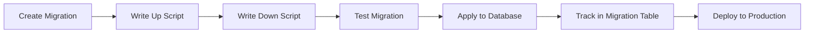

# Migration System - Complete Guide

The Goofer ORM migration system allows you to manage database schema changes over time in a controlled and versioned manner. This guide covers everything from basic migrations to advanced scenarios.

## Table of Contents

1. [Migration Concepts](#migration-concepts)
2. [Basic Migration Usage](#basic-migration-usage)
3. [Migration File Structure](#migration-file-structure)
4. [Advanced Migration Patterns](#advanced-migration-patterns)
5. [Data Migrations](#data-migrations)
6. [Migration Best Practices](#migration-best-practices)
7. [Rollback Strategies](#rollback-strategies)
8. [Production Migration Workflows](#production-migration-workflows)

## Migration Concepts

### What are Migrations?

Migrations are versioned database schema changes that allow you to:
- Evolve your database schema over time
- Share schema changes with team members
- Deploy consistent database changes across environments
- Roll back problematic changes
- Track the history of schema modifications

### Migration Lifecycle



## Basic Migration Usage

### Setting Up Migration System

```go
package main

import (
    "database/sql"
    "log"
    
    _ "github.com/mattn/go-sqlite3"
    
    "github.com/gooferOrm/goofer/dialect"
    "github.com/gooferOrm/goofer/migration"
    "github.com/gooferOrm/goofer/schema"
)

func main() {
    // Open database connection
    db, err := sql.Open("sqlite3", "./app.db")
    if err != nil {
        log.Fatalf("Failed to open database: %v", err)
    }
    defer db.Close()
    
    // Create dialect
    sqliteDialect := dialect.NewSQLiteDialect()
    
    // Create migrator
    migrator := migration.NewMigrator(db, sqliteDialect, "./migrations")
    
    // Initialize migration system (creates migration tracking table)
    if err := migrator.Init(); err != nil {
        log.Fatalf("Failed to initialize migrator: %v", err)
    }
    
    // Run pending migrations
    if err := migrator.Up(); err != nil {
        log.Fatalf("Failed to run migrations: %v", err)
    }
    
    log.Println("Migrations completed successfully")
}
```

### Generating Migrations

```go
// Generate migration from registered entities
func generateEntityMigrations() {
    // Register your entities
    schema.Registry.RegisterEntity(User{})
    schema.Registry.RegisterEntity(Post{})
    
    // Create migration generator
    generator := migration.NewMigrationGenerator(
        schema.Registry,
        sqliteDialect,
        "./migrations",
    )
    
    // Generate migration files
    if err := generator.Generate("create_initial_tables"); err != nil {
        log.Fatalf("Failed to generate migration: %v", err)
    }
}
```

### Manual Migration Creation

```go
// Create a custom migration
func createCustomMigration() {
    migrator := migration.NewMigrator(db, dialect, "./migrations")
    
    // Create a new migration file
    migrationID := "20240126120000_add_user_preferences"
    
    upSQL := `
    CREATE TABLE user_preferences (
        id INTEGER PRIMARY KEY AUTOINCREMENT,
        user_id INTEGER NOT NULL,
        preference_key VARCHAR(100) NOT NULL,
        preference_value TEXT,
        created_at TIMESTAMP DEFAULT CURRENT_TIMESTAMP,
        FOREIGN KEY (user_id) REFERENCES users(id),
        UNIQUE(user_id, preference_key)
    );
    
    CREATE INDEX idx_user_preferences_user_id ON user_preferences(user_id);
    `
    
    downSQL := `
    DROP INDEX IF EXISTS idx_user_preferences_user_id;
    DROP TABLE IF EXISTS user_preferences;
    `
    
    if err := migrator.CreateMigration(migrationID, upSQL, downSQL); err != nil {
        log.Fatalf("Failed to create migration: %v", err)
    }
}
```

## Migration File Structure

### Directory Layout

```
migrations/
├── 20240126100000_create_users_table.up.sql
├── 20240126100000_create_users_table.down.sql
├── 20240126110000_create_posts_table.up.sql
├── 20240126110000_create_posts_table.down.sql
├── 20240126120000_add_user_preferences.up.sql
├── 20240126120000_add_user_preferences.down.sql
└── 20240126130000_add_post_categories.up.sql
└── 20240126130000_add_post_categories.down.sql
```

### Migration File Naming

Migration files follow the pattern:
```
{timestamp}_{description}.{direction}.sql
```

Where:
- `timestamp`: `YYYYMMDDHHMMSS` format for ordering
- `description`: Snake_case description of the change
- `direction`: Either `up` (apply) or `down` (rollback)

### Example Migration Files

#### 20240126100000_create_users_table.up.sql
```sql
CREATE TABLE users (
    id INTEGER PRIMARY KEY AUTOINCREMENT,
    name VARCHAR(255) NOT NULL,
    email VARCHAR(255) NOT NULL UNIQUE,
    password VARCHAR(255) NOT NULL,
    created_at TIMESTAMP DEFAULT CURRENT_TIMESTAMP,
    updated_at TIMESTAMP
);

CREATE INDEX idx_users_email ON users(email);
CREATE INDEX idx_users_created_at ON users(created_at);
```

#### 20240126100000_create_users_table.down.sql
```sql
DROP INDEX IF EXISTS idx_users_created_at;
DROP INDEX IF EXISTS idx_users_email;
DROP TABLE IF EXISTS users;
```

## Advanced Migration Patterns

### Schema Modifications

#### Adding Columns

```sql
-- up migration
ALTER TABLE users ADD COLUMN phone VARCHAR(20);
ALTER TABLE users ADD COLUMN email_verified BOOLEAN DEFAULT FALSE;

-- down migration  
ALTER TABLE users DROP COLUMN email_verified;
ALTER TABLE users DROP COLUMN phone;
```

#### Modifying Columns (SQLite approach)

```sql
-- up migration (SQLite doesn't support ALTER COLUMN directly)
-- Create new table with updated schema
CREATE TABLE users_new (
    id INTEGER PRIMARY KEY AUTOINCREMENT,
    name VARCHAR(100) NOT NULL, -- Changed from VARCHAR(255)
    email VARCHAR(255) NOT NULL UNIQUE,
    password VARCHAR(255) NOT NULL,
    created_at TIMESTAMP DEFAULT CURRENT_TIMESTAMP,
    updated_at TIMESTAMP
);

-- Copy data
INSERT INTO users_new SELECT * FROM users;

-- Drop old table and rename new one
DROP TABLE users;
ALTER TABLE users_new RENAME TO users;

-- Recreate indexes
CREATE INDEX idx_users_email ON users(email);
```

#### Adding Indexes

```sql
-- up migration
CREATE INDEX idx_users_name ON users(name);
CREATE INDEX idx_users_status_created ON users(status, created_at);

-- For unique constraints
CREATE UNIQUE INDEX idx_users_username ON users(username);

-- down migration
DROP INDEX IF EXISTS idx_users_status_created;
DROP INDEX IF EXISTS idx_users_name;
DROP INDEX IF EXISTS idx_users_username;
```

### Complex Schema Changes

#### Table Restructuring

```sql
-- up migration: Split user table into users and profiles
CREATE TABLE profiles (
    id INTEGER PRIMARY KEY AUTOINCREMENT,
    user_id INTEGER NOT NULL UNIQUE,
    bio TEXT,
    avatar_url VARCHAR(255),
    website VARCHAR(255),
    created_at TIMESTAMP DEFAULT CURRENT_TIMESTAMP,
    FOREIGN KEY (user_id) REFERENCES users(id)
);

-- Migrate existing data
INSERT INTO profiles (user_id, bio, avatar_url, website)
SELECT id, bio, avatar_url, website FROM users 
WHERE bio IS NOT NULL OR avatar_url IS NOT NULL OR website IS NOT NULL;

-- Remove columns from users table (SQLite approach)
CREATE TABLE users_new (
    id INTEGER PRIMARY KEY AUTOINCREMENT,
    name VARCHAR(255) NOT NULL,
    email VARCHAR(255) NOT NULL UNIQUE,
    password VARCHAR(255) NOT NULL,
    created_at TIMESTAMP DEFAULT CURRENT_TIMESTAMP,
    updated_at TIMESTAMP
);

INSERT INTO users_new (id, name, email, password, created_at, updated_at)
SELECT id, name, email, password, created_at, updated_at FROM users;

DROP TABLE users;
ALTER TABLE users_new RENAME TO users;

-- down migration: Reverse the process
-- Add columns back to users
ALTER TABLE users ADD COLUMN bio TEXT;
ALTER TABLE users ADD COLUMN avatar_url VARCHAR(255);
ALTER TABLE users ADD COLUMN website VARCHAR(255);

-- Migrate data back
UPDATE users 
SET bio = (SELECT bio FROM profiles WHERE profiles.user_id = users.id),
    avatar_url = (SELECT avatar_url FROM profiles WHERE profiles.user_id = users.id),
    website = (SELECT website FROM profiles WHERE profiles.user_id = users.id);

-- Drop profiles table
DROP TABLE profiles;
```

## Data Migrations

### Basic Data Migration

```sql
-- up migration: Add default categories
INSERT INTO categories (name, description, created_at) VALUES 
    ('Technology', 'Technology-related posts', CURRENT_TIMESTAMP),
    ('Lifestyle', 'Lifestyle and personal posts', CURRENT_TIMESTAMP),
    ('Business', 'Business and entrepreneurship', CURRENT_TIMESTAMP);

-- Update existing posts to have a default category
UPDATE posts 
SET category_id = (SELECT id FROM categories WHERE name = 'Technology' LIMIT 1)
WHERE category_id IS NULL;

-- down migration
DELETE FROM categories WHERE name IN ('Technology', 'Lifestyle', 'Business');
```

### Complex Data Transformations

```sql
-- up migration: Normalize user names
UPDATE users 
SET name = TRIM(name)
WHERE name != TRIM(name);

-- Split full names into first and last name
ALTER TABLE users ADD COLUMN first_name VARCHAR(100);
ALTER TABLE users ADD COLUMN last_name VARCHAR(100);

UPDATE users 
SET first_name = CASE 
    WHEN INSTR(name, ' ') > 0 THEN SUBSTR(name, 1, INSTR(name, ' ') - 1)
    ELSE name
END,
last_name = CASE 
    WHEN INSTR(name, ' ') > 0 THEN TRIM(SUBSTR(name, INSTR(name, ' ') + 1))
    ELSE ''
END;

-- down migration: Restore original format
UPDATE users 
SET name = CASE 
    WHEN last_name != '' THEN first_name || ' ' || last_name
    ELSE first_name
END;

ALTER TABLE users DROP COLUMN first_name;
ALTER TABLE users DROP COLUMN last_name;
```

### Migration with Go Code

For complex data migrations that require business logic:

```go
// Define a migration that uses Go code
type DataMigration20240126130000 struct {
    db      *sql.DB
    dialect dialect.Dialect
}

func (m *DataMigration20240126130000) Up() error {
    // SQL schema changes first
    _, err := m.db.Exec(`
        ALTER TABLE users ADD COLUMN email_hash VARCHAR(64);
        CREATE INDEX idx_users_email_hash ON users(email_hash);
    `)
    if err != nil {
        return err
    }
    
    // Go code for data transformation
    rows, err := m.db.Query("SELECT id, email FROM users")
    if err != nil {
        return err
    }
    defer rows.Close()
    
    for rows.Next() {
        var id uint
        var email string
        if err := rows.Scan(&id, &email); err != nil {
            return err
        }
        
        // Generate hash using Go
        hash := sha256.Sum256([]byte(email))
        emailHash := hex.EncodeToString(hash[:])
        
        // Update record
        _, err := m.db.Exec("UPDATE users SET email_hash = ? WHERE id = ?", emailHash, id)
        if err != nil {
            return err
        }
    }
    
    return nil
}

func (m *DataMigration20240126130000) Down() error {
    _, err := m.db.Exec(`
        DROP INDEX IF EXISTS idx_users_email_hash;
        ALTER TABLE users DROP COLUMN email_hash;
    `)
    return err
}

// Register and run the migration
func runDataMigration() {
    migration := &DataMigration20240126130000{
        db:      db,
        dialect: sqliteDialect,
    }
    
    migrator := migration.NewMigrator(db, sqliteDialect, "./migrations")
    migrator.RegisterCustomMigration("20240126130000", migration)
    
    if err := migrator.Up(); err != nil {
        log.Fatalf("Migration failed: %v", err)
    }
}
```

## Migration Best Practices

### 1. Always Write Reversible Migrations

```sql
-- GOOD: Reversible
-- up
ALTER TABLE users ADD COLUMN phone VARCHAR(20);

-- down  
ALTER TABLE users DROP COLUMN phone;

-- BAD: Not easily reversible
-- up
DROP TABLE old_logs; -- Data is lost forever
```

### 2. Test Migrations Thoroughly

```go
func TestMigration20240126100000(t *testing.T) {
    // Setup test database
    db, err := sql.Open("sqlite3", ":memory:")
    require.NoError(t, err)
    defer db.Close()
    
    migrator := migration.NewMigrator(db, dialect.NewSQLiteDialect(), "./test_migrations")
    
    // Test up migration
    err = migrator.UpTo("20240126100000")
    require.NoError(t, err)
    
    // Verify schema exists
    var tableName string
    err = db.QueryRow("SELECT name FROM sqlite_master WHERE type='table' AND name='users'").Scan(&tableName)
    require.NoError(t, err)
    assert.Equal(t, "users", tableName)
    
    // Test down migration
    err = migrator.DownTo("20240126095959") // Before this migration
    require.NoError(t, err)
    
    // Verify schema is removed
    err = db.QueryRow("SELECT name FROM sqlite_master WHERE type='table' AND name='users'").Scan(&tableName)
    assert.Error(t, err) // Should not exist
}
```

### 3. Use Transactions

```sql
-- Wrap migrations in transactions where possible
BEGIN;

ALTER TABLE users ADD COLUMN status VARCHAR(20) DEFAULT 'active';
CREATE INDEX idx_users_status ON users(status);
UPDATE users SET status = 'active' WHERE status IS NULL;

COMMIT;
```

### 4. Handle Large Data Sets

```sql
-- For large tables, process in batches
-- Instead of: UPDATE users SET email = LOWER(email);

-- Use batched approach:
UPDATE users 
SET email = LOWER(email) 
WHERE id IN (
    SELECT id FROM users 
    WHERE email != LOWER(email) 
    LIMIT 1000
);

-- Repeat until no more rows are affected
```

### 5. Backup Before Major Changes

```bash
#!/bin/bash
# backup_and_migrate.sh

# Create backup
pg_dump myapp_production > backup_$(date +%Y%m%d_%H%M%S).sql

# Run migrations
./migrate up

# Verify migration success
if [ $? -eq 0 ]; then
    echo "Migration successful"
else
    echo "Migration failed, restore from backup if needed"
    exit 1
fi
```

## Rollback Strategies

### Automatic Rollback

```go
func safeRunMigrations() error {
    migrator := migration.NewMigrator(db, dialect, "./migrations")
    
    // Get current migration version
    currentVersion, err := migrator.CurrentVersion()
    if err != nil {
        return err
    }
    
    // Attempt to run migrations
    err = migrator.Up()
    if err != nil {
        log.Printf("Migration failed: %v", err)
        log.Println("Rolling back to previous version...")
        
        // Rollback to previous version
        rollbackErr := migrator.DownTo(currentVersion)
        if rollbackErr != nil {
            return fmt.Errorf("migration failed and rollback failed: %v (original error: %v)", rollbackErr, err)
        }
        
        return fmt.Errorf("migration failed and was rolled back: %v", err)
    }
    
    return nil
}
```

### Stepwise Rollback

```go
// Rollback one migration at a time
func rollbackStep() error {
    migrator := migration.NewMigrator(db, dialect, "./migrations")
    
    current, err := migrator.CurrentVersion()
    if err != nil {
        return err
    }
    
    // Get previous migration
    previous, err := migrator.PreviousVersion(current)
    if err != nil {
        return err
    }
    
    log.Printf("Rolling back from %s to %s", current, previous)
    return migrator.DownTo(previous)
}
```

### Rollback with Data Verification

```go
func rollbackWithVerification() error {
    migrator := migration.NewMigrator(db, dialect, "./migrations")
    
    // Check data integrity before rollback
    if err := verifyDataIntegrity(); err != nil {
        return fmt.Errorf("data integrity check failed: %v", err)
    }
    
    // Perform rollback
    err := migrator.Down()
    if err != nil {
        return err
    }
    
    // Verify data integrity after rollback
    if err := verifyDataIntegrity(); err != nil {
        return fmt.Errorf("data integrity check failed after rollback: %v", err)
    }
    
    return nil
}

func verifyDataIntegrity() error {
    // Check for orphaned records
    var orphanedPosts int
    err := db.QueryRow(`
        SELECT COUNT(*) FROM posts 
        WHERE user_id NOT IN (SELECT id FROM users)
    `).Scan(&orphanedPosts)
    
    if err != nil {
        return err
    }
    
    if orphanedPosts > 0 {
        return fmt.Errorf("found %d orphaned posts", orphanedPosts)
    }
    
    return nil
}
```

## Production Migration Workflows

### Blue-Green Deployment Migration

```go
// Blue-Green migration strategy
func blueGreenMigration() error {
    // 1. Run migrations on blue environment
    blueDB, err := sql.Open("postgres", blueDBURL)
    if err != nil {
        return err
    }
    defer blueDB.Close()
    
    blueMigrator := migration.NewMigrator(blueDB, postgresDialect, "./migrations")
    
    // Test migrations on blue
    if err := blueMigrator.Up(); err != nil {
        return fmt.Errorf("blue environment migration failed: %v", err)
    }
    
    // 2. Verify blue environment
    if err := verifyEnvironment(blueDB); err != nil {
        return fmt.Errorf("blue environment verification failed: %v", err)
    }
    
    // 3. Switch traffic to blue (done externally)
    log.Println("Ready to switch traffic to blue environment")
    
    return nil
}
```

### Zero-Downtime Migration

```go
// Zero-downtime migration with backward compatibility
func zeroDowntimeMigration() error {
    // Phase 1: Add new column (nullable)
    phase1 := `
    ALTER TABLE users ADD COLUMN new_email VARCHAR(255);
    CREATE INDEX idx_users_new_email ON users(new_email);
    `
    
    // Phase 2: Populate new column
    phase2 := `
    UPDATE users SET new_email = email WHERE new_email IS NULL;
    `
    
    // Phase 3: Deploy application that uses both columns
    // Phase 4: Make new column NOT NULL
    phase4 := `
    -- Create new table with NOT NULL constraint
    CREATE TABLE users_new (
        id INTEGER PRIMARY KEY,
        name VARCHAR(255) NOT NULL,
        email VARCHAR(255) NOT NULL,
        new_email VARCHAR(255) NOT NULL,
        created_at TIMESTAMP DEFAULT CURRENT_TIMESTAMP
    );
    
    INSERT INTO users_new SELECT * FROM users;
    DROP TABLE users;
    ALTER TABLE users_new RENAME TO users;
    `
    
    // Phase 5: Remove old column
    phase5 := `
    ALTER TABLE users DROP COLUMN email;
    ALTER TABLE users RENAME COLUMN new_email TO email;
    `
    
    // Execute phases with application deployments in between
    phases := []string{phase1, phase2, phase4, phase5}
    
    for i, sql := range phases {
        log.Printf("Executing migration phase %d", i+1)
        if _, err := db.Exec(sql); err != nil {
            return fmt.Errorf("phase %d failed: %v", i+1, err)
        }
        
        // Wait for application deployment confirmation
        if i < len(phases)-1 {
            log.Printf("Deploy application for phase %d, then press Enter to continue", i+1)
            fmt.Scanln()
        }
    }
    
    return nil
}
```

### Monitoring Migration Progress

```go
type MigrationMonitor struct {
    migrator *migration.Migrator
    metrics  *prometheus.Registry
}

func (m *MigrationMonitor) RunWithMonitoring() error {
    start := time.Now()
    
    // Track migration progress
    migrations, err := m.migrator.PendingMigrations()
    if err != nil {
        return err
    }
    
    log.Printf("Starting %d pending migrations", len(migrations))
    
    for i, migration := range migrations {
        migrationStart := time.Now()
        
        log.Printf("Running migration %d/%d: %s", i+1, len(migrations), migration.ID)
        
        err := m.migrator.RunMigration(migration.ID)
        if err != nil {
            // Record failure metric
            m.recordMigrationFailure(migration.ID, err)
            return err
        }
        
        duration := time.Since(migrationStart)
        log.Printf("Migration %s completed in %v", migration.ID, duration)
        
        // Record success metric
        m.recordMigrationSuccess(migration.ID, duration)
    }
    
    totalDuration := time.Since(start)
    log.Printf("All migrations completed in %v", totalDuration)
    
    return nil
}

func (m *MigrationMonitor) recordMigrationSuccess(migrationID string, duration time.Duration) {
    // Record to monitoring system
    // migrationDuration.WithLabelValues(migrationID).Observe(duration.Seconds())
    // migrationStatus.WithLabelValues(migrationID, "success").Inc()
}
```

### Migration Status Dashboard

```go
// HTTP handler for migration status
func migrationStatusHandler(migrator *migration.Migrator) http.HandlerFunc {
    return func(w http.ResponseWriter, r *http.Request) {
        status := struct {
            CurrentVersion    string              `json:"current_version"`
            PendingMigrations []string            `json:"pending_migrations"`
            AppliedMigrations []migration.Applied `json:"applied_migrations"`
            LastError         string              `json:"last_error,omitempty"`
        }{}
        
        // Get current version
        current, err := migrator.CurrentVersion()
        if err != nil {
            status.LastError = err.Error()
        } else {
            status.CurrentVersion = current
        }
        
        // Get pending migrations
        pending, err := migrator.PendingMigrations()
        if err != nil {
            status.LastError = err.Error()
        } else {
            for _, p := range pending {
                status.PendingMigrations = append(status.PendingMigrations, p.ID)
            }
        }
        
        // Get applied migrations
        applied, err := migrator.AppliedMigrations()
        if err != nil {
            status.LastError = err.Error()
        } else {
            status.AppliedMigrations = applied
        }
        
        w.Header().Set("Content-Type", "application/json")
        json.NewEncoder(w).Encode(status)
    }
}
```

This comprehensive migration guide provides everything needed to manage database schema changes effectively in production environments, from basic migrations to complex zero-downtime deployment strategies.